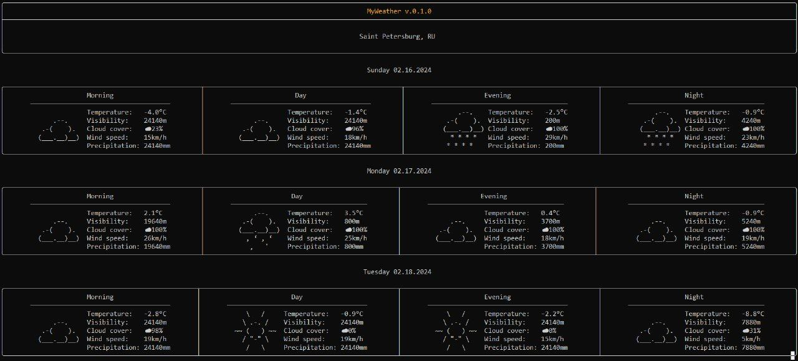

# WeatherForecast

> Weather forecast for the selected list of cities using third-party libraries

## Technical specification

- Display the weather forecast for several days ahead (the default value is set by the config)

- Update with some frequency (set by the config)

- Switch between cities using the **"n"**, **"p"** keys

- End the program by **Esc**

- To increase / decrease the number of forecast days by pressing the **"+"**, **"-"** keys

- The list of cities, the update frequency, the number of forecast days must be defined in the config

## An example of a running console app



## Weather data sources

- [Open-Meteo](https://open-meteo.com/en/docs#latitude=59.94&longitude=30.31&hourly=temperature_2m&forecast_days=16) for the weather forecast
- [Api-Ninjas](https://api-ninjas.com/api/city) to determine the coordinates by the name of the city

## Third-party libraries

1. [C++ requests](https://github.com/libcpr/cpr) to work with HTTP requests
2. [Nlohmann's json](https://github.com/nlohmann/json) to parse JSONs
3. [FTXUI](https://github.com/ArthurSonzogni/ftxui) to create a user interface
4. [RapidXML](https://github.com/Fe-Bell/RapidXML) to process the config in XML format

## Config example

```xml
<?xml version="1.0" encoding="utf-8"?>
<MyWeatherConfiguration>
    <ListOfCities>
        <City>Saint Petersburg, RU</City>
        <City>Miami, US</City>
        <City>Tokyo, JP</City>
    </ListOfCities>
    <UpdateFrequency>15</UpdateFrequency>
    <NumberOfDays>3</NumberOfDays>
</MyWeatherConfiguration>
```